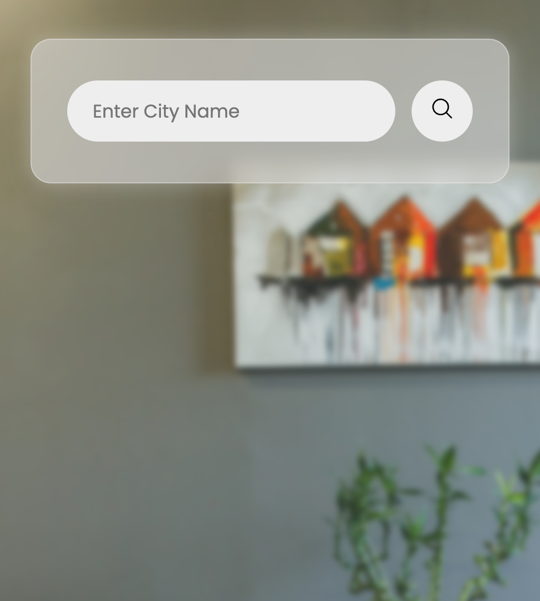
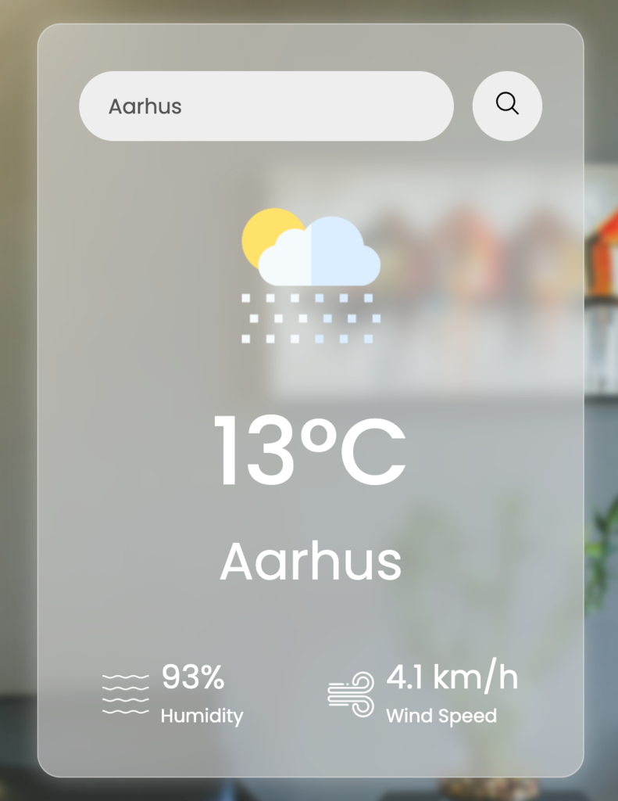

# Weather App

This is a weather app that allows users to check current weather conditions for any location. The app features a clean, responsive design with real-time weather updates.

## Project Overview

- **Type:** Web Development
- **Date:** Updated March 2024
- **Technology Stack:** HTML, CSS, JavaScript

## Features

- **Current Weather**: Get real-time weather data for any city worldwide
- **Geolocation**: Automatically detects user location on page load
- **Temperature Units**: Toggle between Celsius and Fahrenheit
- **Responsive Design**: Works on all device sizes from mobile to desktop
- **Accessibility**: ARIA attributes and semantic HTML for better accessibility
- **Performance Optimized**: Data caching to reduce API calls
- **Error Handling**: Graceful error handling with user-friendly messages

<!-- 

 -->

|  |  |
| :---------------------------------------------------: | :---------------------------------------------------: |
|                     On page load                      |              After searching for a city               |

## Technologies Used

- **HTML5**: Semantic structure
- **CSS3**: Modern styling with flexbox and media queries
- **JavaScript**: ES6+ features and async/await for API calls
- **APIs**: OpenWeatherMap API for weather data
- **Geolocation API**: Browser geolocation for automatic location detection

## How It Works

1. **Geolocation**: On first load, the app tries to get the user's location
2. **Weather Data**: Fetches current weather from OpenWeatherMap API
3. **Caching**: Stores recent searches to reduce API calls
4. **Unit Conversion**: Allows switching between metric and imperial units

## Code Structure

- **HTML**: Semantic markup with accessibility attributes
- **CSS**: Responsive design with modern techniques
- **JavaScript**: Modular functions with proper error handling
- **Config**: Centralized configuration for easy maintenance

## Future Improvements

- Add 5-day weather forecast
- Implement dark/light theme toggle
- Add more detailed weather information (pressure, sunrise/sunset)
- Create a backend proxy to secure API keys

## Installation

1. Clone the repository
2. Open index.html in your browser
3. Allow location permissions for full functionality

## API Key

The app uses OpenWeatherMap API. For security reasons, in a production environment, the API key should be handled server-side.

## Credits

- Weather data provided by [OpenWeatherMap](https://openweathermap.org/)
- Icons and design inspiration from various sources

**Designed and developed by Paolo Papania**

[Portfolio](https://www.papaniap.dk) | [LinkedIn](https://www.linkedin.com/in/papaniap/)
